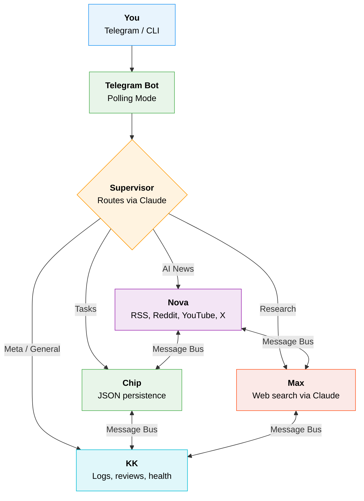

<div align="center">

#  AI Agent Hub

**A multi-agent AI system that lives in your Telegram.**

Four agents with distinct personalities. One chat. They route, collaborate, and hand off work seamlessly.

[](https://python.org)
[](https://core.telegram.org/bots)
[](https://docs.anthropic.com/en/docs/claude-code)
[](LICENSE)

---

*Just talk to it. The right agent answers.*

</div>

<br/>

##  Meet the Team

<table>
<tr>
<td align="center" width="25%">

###  Nova
**Intelligence Agent**

*"DID YOU SEE THIS?!"*

Fetches AI news from RSS, Reddit, YouTube, X/Twitter. The hyperactive news junkie who texts at 2am about arxiv papers and calls out hype with a witty one-liner.

</td>
<td align="center" width="25%">

###  Chip
**Todo Agent**

*"Look at you being productive!"*

Manages tasks with add, complete, delete, and prioritize. The supportive life coach with dad joke energy who celebrates every checkbox like a championship.

</td>
<td align="center" width="25%">

###  Max
**Research Agent**

*"Pull up a chair."*

Market research, competitor analysis, idea validation. The street-smart business analyst who tells it like it is with a wink and delivers truth with charm.

</td>
<td align="center" width="25%">

###  KK
**Meta Agent**

*"Let me take a step back..."*

System oversight, agent reviews, health checks, strategy. The wise mentor with dry wit who sees the big picture and always has your back.

</td>
</tr>
</table>

> A **Supervisor** silently routes every message to the right agent. You just talk naturally.

<br/>

##  Architecture



<details>
<summary><b>Key Design Decisions</b></summary>

- **Inter-Agent Communication** — Agents talk through a shared message bus. The supervisor can chain agents: *"get AI news and add the top story to my todo"* routes through Nova, then hands off to Chip.
- **Activity Logging** — Every interaction is logged. KK can review any agent's work and give an honest assessment.
- **Single LLM Backend** — All calls go through Claude CLI (`agents/llm.py`). No API key management needed.
- **Personality-First** — Each agent has a distinct voice. Makes the system fun to interact with and easy to know who's talking.

</details>

<br/>

##  Quick Start

### Prerequisites

| Requirement | Purpose |
|:--|:--|
| **Python 3.9+** | Runtime |
| **[Claude CLI](https://docs.anthropic.com/en/docs/claude-code)** | LLM backend (uses your existing auth) |
| **Telegram Bot Token** | Get one from [@BotFather](https://t.me/BotFather) |

### 1. Clone & Install

```bash
git clone https://github.com/jiaqi961210/ai-agent-hub.git
cd ai-agent-hub
pip install -r requirements.txt
```

### 2. Configure

Create a `.env` file in the project root:

```env
# Required
TELEGRAM_BOT_TOKEN=your-telegram-bot-token

# Optional — enables full Intelligence Agent sources
REDDIT_CLIENT_ID=your-reddit-client-id
REDDIT_CLIENT_SECRET=your-reddit-client-secret
YOUTUBE_API_KEY=your-youtube-api-key
TWITTER_BEARER_TOKEN=your-twitter-bearer-token
```

### 3. Run

```bash
# Telegram bot (primary)
python telegram_bot.py

# Or CLI mode (no Telegram needed)
python main.py
```

<br/>

##  Telegram Commands

| Command | Agent | What It Does |
|:--------|:------|:-------------|
| `/start` | -- | Show all available commands |
| `/news [topic]` | Nova | Fetch the latest AI news |
| `/todo [instruction]` | Chip | Manage your task list |
| `/ask [anything]` | Supervisor | Auto-route to the best agent |
| `/research [idea]` | Max | Market research & competitor analysis |
| `/kk [question]` | KK | System insights & agent reviews |
| `/status` | KK | Quick system health check |
| `/review` | KK | Audit the last agent's output |
| *Any message* | Supervisor | Automatically routed to the right agent |

### Example Conversations

```
You: hey what's up
 KK: Hey! Good to see you. Here's what's been happening with the crew...

You: what's the latest in AI
 Nova: OH BOY do I have news for you! 🔥 Here are today's top stories...

You: add "read the Claude docs" to my list
 Chip: Added it! You've got 3 tasks now — look at you being all productive!

You: is there a market for AI code review tools
 Max: Pull up a chair, let's talk about this market...

You: get AI news and add anything interesting to my todo
 Nova: [fetches news] ──handoff──> Chip: [creates tasks from top stories]
```

<br/>

##  Project Structure

```
ai-agent-hub/
│
├── telegram_bot.py              Telegram bot — main entry point
├── main.py                      CLI entry point (Rich terminal UI)
├── daily_news.py                Cron-triggered daily AI digest
├── daily_news_runner.sh         Shell wrapper with retry logic
├── requirements.txt             Python dependencies
├── .env                         API keys (git-ignored)
│
├── agents/
│   ├── supervisor.py            Routes messages & manages handoffs
│   ├── intelligence_agent.py    Nova — AI news from 4 source types
│   ├── todo_agent.py            Chip — task CRUD with JSON storage
│   ├── research_agent.py        Max — market research via web search
│   ├── kk_agent.py              KK — meta-agent & system oversight
│   ├── message_bus.py           Inter-agent communication layer
│   └── llm.py                   Claude CLI wrapper
│
└── data/
    ├── todos.json               Persistent task storage
    ├── agent_logs.json          Agent activity history
    ├── message_bus.json         Inter-agent messages
    └── daily_news.md            Latest news digest
```

<br/>

##  How It Works

```
1. You send a message ──> Telegram Bot receives it
2. Supervisor classifies intent ──> picks the right agent
3. One agent responds with its unique personality
4. If needed, supervisor chains a second agent via handoff
5. KK logs everything ──> available for review anytime
```

All LLM calls go through the Claude CLI — no API key to manage. It uses your existing Claude authentication.

<br/>

##  Optional: Daily News Cron

Get a personalized AI news digest every morning:

```bash
crontab -e
```

```cron
*/12 9-10 * * * /path/to/ai-agent-hub/daily_news_runner.sh
```

Saves to `data/daily_news.md` with dated archives. Includes a macOS notification when ready.

<br/>

##  Tech Stack

| Technology | Role |
|:--|:--|
| **Claude CLI** | All LLM interactions — no direct API calls |
| **python-telegram-bot** | Telegram integration (polling, no webhook) |
| **Rich** | Beautiful terminal UI for CLI mode |
| **feedparser** | RSS feed parsing |
| **praw** | Reddit API client |
| **tweepy** | Twitter/X API client |
| **google-api-python-client** | YouTube Data API |

<br/>

---

<div align="center">

**Built with Claude** | **[Telegram Setup Guide](TELEGRAM_SETUP.md)**

*Talk to your agents. They're waiting.*

</div>
