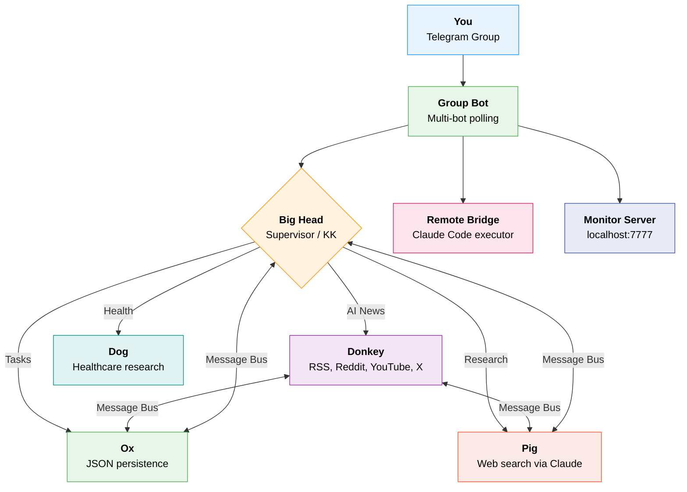

<div align="center">

#  AI Agent Hub

**A multi-agent AI system that lives in your Telegram.**

Five agents with distinct personalities. One group chat. They route, collaborate, and hand off work seamlessly.

[](https://python.org)
[](https://core.telegram.org/bots)
[](https://docs.anthropic.com/en/docs/claude-code)
[](LICENSE)

---

*Just talk to it. The right agent answers.*

</div>

<br/>

##  Meet the Team

The agents are the five reincarnations of Ximen Nao, each with their own Telegram bot identity.

<table>
<tr>
<td align="center" width="20%">

### 人 Big Head
**Meta Agent (KK)**

*"Let me take a step back..."*

System oversight, agent reviews, health checks, strategy. The wise supervisor who routes every message and always has your back.

</td>
<td align="center" width="20%">

### 驴 Donkey
**Intelligence Agent**

*"DID YOU SEE THIS?!"*

Fetches AI news from RSS, Reddit, YouTube, X/Twitter. The hyperactive news junkie who texts at 2am about arxiv papers.

</td>
<td align="center" width="20%">

### 牛 Ox
**Todo Agent**

*"Look at you being productive!"*

Manages tasks with add, complete, delete, and prioritize. The supportive life coach with dad joke energy.

</td>
<td align="center" width="20%">

### 猪 Pig
**Research Agent**

*"Pull up a chair."*

Market research, competitor analysis, idea validation. The street-smart business analyst who tells it like it is.

</td>
<td align="center" width="20%">

### 狗 Dog
**Health Agent**

*"Guarding your health fiercely."*

Evidence-based healthcare research. Specialized in oncology, rheumatology, geriatrics, and drug interactions. Cites evidence levels and flags condition conflicts.

</td>
</tr>
</table>

> A **Supervisor** silently routes every message to the right agent. You just talk naturally.

<br/>

##  Architecture



<details>
<summary><b>Key Design Decisions</b></summary>

- **Multi-Bot Group Chat** — Each agent has its own Telegram bot. When you message the group, the supervisor decides which bot replies — giving each agent a distinct presence.
- **Remote Bridge** — Send commands from Telegram and they execute via a live Claude Code session on your Mac. Results come back to the chat.
- **Monitor Server** — A minimal web dashboard at `localhost:7777` shows real-time agent activity, logs, and system health.
- **Shared Chat History** — All bots share a rolling 50-message memory so agents have context of the full group conversation.
- **Inter-Agent Communication** — Agents talk through a shared message bus. The supervisor can chain agents: *"get AI news and add the top story to my todo"* routes through Donkey, then hands off to Ox.
- **Single LLM Backend** — All calls go through Claude CLI (`agents/llm.py`). No API key management needed.

</details>

<br/>

##  Quick Start

### Prerequisites

| Requirement | Purpose |
|:--|:--|
| **Python 3.9+** | Runtime |
| **[Claude CLI](https://docs.anthropic.com/en/docs/claude-code)** | LLM backend (uses your existing auth) |
| **Telegram Bot Tokens** | One per agent — get from [@BotFather](https://t.me/BotFather) |

### 1. Clone & Install

```bash
git clone https://github.com/jiaqi961210/ai-agent-hub.git
cd ai-agent-hub
pip install -r requirements.txt
```

### 2. Configure

Create a `.env` file in the project root:

```env
# Multi-bot group chat (one token per agent)
TELEGRAM_BOT_TOKEN_BIGHEAD=your-bighead-bot-token
TELEGRAM_BOT_TOKEN_DONKEY=your-donkey-bot-token
TELEGRAM_BOT_TOKEN_OX=your-ox-bot-token
TELEGRAM_BOT_TOKEN_PIG=your-pig-bot-token
TELEGRAM_BOT_TOKEN_DOG=your-dog-bot-token

# Legacy single-bot mode
TELEGRAM_BOT_TOKEN=your-single-bot-token

# Optional — enables full Intelligence Agent sources
REDDIT_CLIENT_ID=your-reddit-client-id
REDDIT_CLIENT_SECRET=your-reddit-client-secret
YOUTUBE_API_KEY=your-youtube-api-key
TWITTER_BEARER_TOKEN=your-twitter-bearer-token
```

### 3. Run

```bash
# Multi-bot Telegram group chat (recommended)
python telegram_group_bot.py

# Single-bot Telegram mode
python telegram_bot.py

# Web monitor dashboard (separate terminal)
python monitor_server.py        # → http://localhost:7777

# Remote bridge — execute commands from Telegram via Claude Code
python remote_bridge.py

# CLI mode (no Telegram needed)
python main.py
```

<br/>

##  Telegram Commands

| Command | Agent | What It Does |
|:--------|:------|:-------------|
| `/start` | -- | Show all available commands |
| `/news [topic]` | Donkey | Fetch the latest AI news |
| `/todo [instruction]` | Ox | Manage your task list |
| `/ask [anything]` | Supervisor | Auto-route to the best agent |
| `/research [idea]` | Pig | Market research & competitor analysis |
| `/health [question]` | Dog | Evidence-based healthcare research |
| `/kk [question]` | Big Head | System insights & agent reviews |
| `/status` | Big Head | Quick system health check |
| `/review` | Big Head | Audit the last agent's output |
| *Any message* | Supervisor | Automatically routed to the right agent |

### Example Conversations

```
You: what's the latest in AI
 Donkey: OH BOY do I have news for you! 🔥 Here are today's top stories...

You: add "read the Claude docs" to my list
 Ox: Added it! You've got 3 tasks now — look at you being all productive!

You: is there a market for AI code review tools
 Pig: Pull up a chair, let's talk about this market...

You: what supplements are safe for gout and gastric cancer together?
 Dog: Great question. Here's what the evidence says...

You: get AI news and add anything interesting to my todo
 Donkey: [fetches news] ──handoff──> Ox: [creates tasks from top stories]
```

<br/>

##  Project Structure

```
ai-agent-hub/
│
├── telegram_group_bot.py        Multi-bot group chat — main entry point
├── telegram_bot.py              Single-bot Telegram mode
├── main.py                      CLI entry point (Rich terminal UI)
├── monitor_server.py            Web dashboard at localhost:7777
├── remote_bridge.py             Claude Code executor triggered from Telegram
├── bot_config.py                Bot ↔ agent token mappings
├── bot_registry.py              Central registry for all bot instances
├── daily_news.py                Cron-triggered daily AI digest
├── daily_news_runner.sh         Shell wrapper with retry logic
├── requirements.txt             Python dependencies
├── .env                         API keys (git-ignored)
│
├── agents/
│   ├── supervisor.py            Routes messages & manages handoffs
│   ├── intelligence_agent.py    Donkey — AI news from 4 source types
│   ├── todo_agent.py            Ox — task CRUD with JSON storage
│   ├── research_agent.py        Pig — market research via web search
│   ├── kk_agent.py              Big Head — meta-agent & system oversight
│   ├── health_agent.py          Dog — evidence-based healthcare research
│   ├── chat_history.py          Shared 50-message group chat memory
│   ├── message_bus.py           Inter-agent communication layer
│   └── llm.py                   Claude CLI wrapper
│
└── data/
    ├── todos.json               Persistent task storage
    ├── agent_logs.json          Agent activity history
    ├── message_bus.json         Inter-agent messages
    ├── chat_history.json        Shared group chat memory
    ├── remote_inbox.json        Commands waiting to run via Remote Bridge
    ├── remote_outbox.json       Results from Remote Bridge
    └── daily_news.md            Latest news digest
```

<br/>

##  How It Works

```
1. You send a message in the Telegram group
2. Big Head (supervisor) classifies intent → picks the right agent
3. That agent's bot responds with its unique personality
4. If needed, supervisor chains a second agent via handoff
5. All messages stored in shared chat history (last 50)
6. Monitor server shows live activity at localhost:7777
```

All LLM calls go through the Claude CLI — no API key to manage. It uses your existing Claude authentication.

<br/>

##  Optional: Daily News Cron

Get a personalized AI news digest every morning:

```bash
crontab -e
```

```cron
*/12 9-10 * * * /path/to/ai-agent-hub/daily_news_runner.sh
```

Saves to `data/daily_news.md` with dated archives. Includes a macOS notification when ready.

<br/>

##  Tech Stack

| Technology | Role |
|:--|:--|
| **Claude CLI** | All LLM interactions — no direct API calls |
| **python-telegram-bot** | Telegram integration (polling, multi-bot) |
| **Rich** | Beautiful terminal UI for CLI mode |
| **feedparser** | RSS feed parsing |
| **praw** | Reddit API client |
| **tweepy** | Twitter/X API client |
| **google-api-python-client** | YouTube Data API |

<br/>

---

<div align="center">

**Built with Claude** | **[Telegram Setup Guide](TELEGRAM_SETUP.md)**

*Talk to your agents. They're waiting.*

</div>
